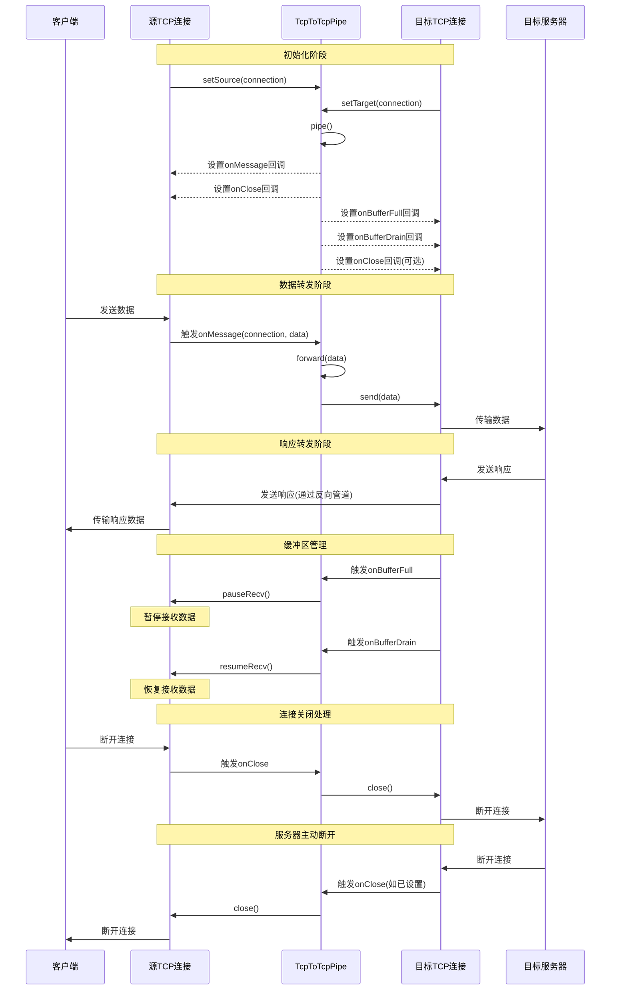

# TCP 到 TCP 连接转发流程

本文档详细说明 workerman-connection-pipe 中 TCP 到 TCP 连接的数据转发工作流程。主要用于 TCP 代理、负载均衡、反向代理和安全网关等场景。

## 流程图

## 详细工作流程说明

### 1. 初始化流程

TCP 到 TCP 连接管道的初始化涉及两个 TCP 连接的设置和回调函数配置：

1. **设置源连接和目标连接**
   - 通过 `setSource()` 方法设置来自客户端的源 TCP 连接
   - 通过 `setTarget()` 方法设置连接到目标服务器的 TCP 连接
   - 两个连接必须是 `TcpConnection` 类型，否则抛出异常

2. **启动管道**
   - 调用 `pipe()` 方法激活管道，将返回管道实例以支持链式调用
   - 设置标志 `isActive = true` 表示管道处于活动状态
   - 记录管道启动日志，包含唯一的管道ID和协议信息

3. **设置回调函数**
   - 在源连接上设置 `onMessage` 回调，用于接收客户端数据并调用 `forward()` 方法
   - 在源连接上设置 `onClose` 回调，用于在客户端断开时关闭目标连接
   - 在目标连接上设置 `onBufferFull` 回调，用于处理目标连接缓冲区满的情况
   - 在目标连接上设置 `onBufferDrain` 回调，用于处理目标连接缓冲区排空的情况
   - 可选：在目标连接上设置 `onClose` 回调，用于处理服务器主动断开的情况

### 2. 数据转发流程

当客户端发送数据到源连接时，数据转发流程如下：

1. **触发源连接的 onMessage 回调**
   - 源 TCP 连接接收到客户端发送的数据
   - 源连接的 `onMessage` 回调被触发，将数据传给管道

2. **调用 forward() 方法**
   - 管道的 `forward()` 方法处理数据转发
   - 检查管道是否处于活动状态，如果不活动则返回 `false`
   - 记录转发日志，包含数据长度和连接 ID 等信息

3. **发送数据到目标连接**
   - 调用目标 TCP 连接的 `send()` 方法发送数据
   - 检查发送结果，如果发送失败则记录错误日志并返回 `false`
   - 如果配置了事件分发器，则触发 `DataForwardedEvent` 事件
   - 数据成功到达目标服务器

### 3. 缓冲区管理机制

TCP 连接管道实现了高效的缓冲区管理机制，确保在高负载情况下的稳定性：

1. **缓冲区满时的处理**
   - 当目标连接的发送缓冲区满时，触发 `onBufferFull` 回调
   - 管道调用源连接的 `pauseRecv()` 方法，暂停从客户端接收数据
   - 这样可以防止内存溢出，尤其是在上游速度快于下游的情况

2. **缓冲区排空后的处理**
   - 当目标连接的发送缓冲区排空时，触发 `onBufferDrain` 回调
   - 管道调用源连接的 `resumeRecv()` 方法，恢复从客户端接收数据
   - 这确保了数据流的平滑，防止连接因缓冲区问题而断开

3. **技术细节**
   - Workerman 默认的 TcpConnection 发送缓冲区大小为 1MB
   - 可以通过 `TcpConnection::$maxSendBufferSize` 调整缓冲区大小
   - 这种动态流控机制是 TCP 连接稳定性的关键，尤其在高流量场景

### 4. 连接关闭处理

连接关闭是 TCP 管道重要的资源管理环节，有以下几种情况：

1. **客户端主动断开**
   - 客户端断开与源连接的连接
   - 源连接的 `onClose` 回调被触发
   - 管道调用目标连接的 `close()` 方法，关闭与服务器的连接
   - 源连接和目标连接的资源被释放

2. **服务器主动断开**
   - 服务器断开与目标连接的连接
   - 如果已设置目标连接的 `onClose` 回调，则被触发
   - 管道可以选择关闭源连接，或保持开启等待重新连接
   - 这取决于具体的应用场景和业务逻辑

3. **管道主动停止**
   - 调用管道的 `unpipe()` 方法停止转发
   - 设置标志 `isActive = false` 表示管道不再活动
   - 记录管道停止日志，但不主动关闭连接
   - 这适用于需要临时暂停转发但保持连接的场景

### 5. 性能与优化建议

TCP 到 TCP 管道的性能优化主要考虑以下几点：

1. **连接复用**
   - 在高并发场景下，考虑使用连接池复用目标连接
   - 对于访问相同目标服务器的多个客户端，可共享连接资源

2. **缓冲区调优**
   - 根据实际业务场景调整 `TcpConnection::$maxSendBufferSize`
   - 大文件传输场景可适当增大缓冲区，小包实时场景可适当减小

3. **心跳保活**
   - 对于长连接场景，实现心跳机制保持连接活跃
   - 可通过定时器定期发送心跳包防止连接超时断开

4. **异常处理**
   - 增强错误处理和异常恢复机制
   - 对于临时网络波动，可实现自动重连和会话恢复

通过合理配置和优化，TCP 到 TCP 管道可以实现高性能、高可靠性的数据转发服务。
