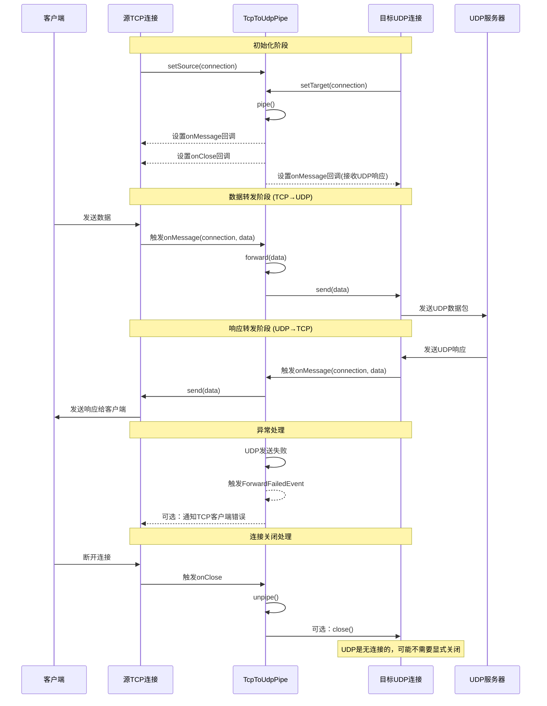

# TCP 到 UDP 连接转发流程

本文档详细介绍 workerman-connection-pipe 中 TCP 到 UDP 连接的数据转发工作流程，主要应用于需要协议转换的场景，如 DNS 代理、TCP 客户端访问 UDP 服务等。

## 流程图

## 详细工作流程说明

### 1. 初始化流程

TCP 到 UDP 连接管道的初始化涉及以下步骤：

1. **设置源连接和目标连接**
   - 通过 `setSource()` 方法设置源 TCP 连接，必须是 `TcpConnection` 类型
   - 通过 `setTarget()` 方法设置目标 UDP 连接，必须是 `UdpConnection` 类型
   - 若连接类型不匹配，将抛出类型异常

2. **启动管道**
   - 调用 `pipe()` 方法激活管道，设置 `isActive = true`
   - 记录管道启动日志，包含管道 ID 和协议类型（TCP->UDP）
   - 返回管道实例，支持链式调用

3. **设置回调函数**
   - 在源 TCP 连接上设置 `onMessage` 回调，用于接收客户端数据
   - 在源 TCP 连接上设置 `onClose` 回调，用于处理客户端断开连接
   - 在目标 UDP 连接上设置 `onMessage` 回调，用于接收 UDP 服务器的响应

### 2. 数据转发流程（TCP 到 UDP）

当 TCP 客户端发送数据时，转发流程如下：

1. **接收 TCP 客户端数据**
   - 源 TCP 连接接收到客户端发送的数据
   - 触发 `onMessage` 回调，将连接对象和数据传递给管道的 `forward()` 方法

2. **处理数据转发**
   - 管道检查活动状态，如不活动则中止转发并返回 `false`
   - 记录转发日志，包含数据长度、源连接信息和目标地址信息
   - 调用目标 UDP 连接的 `send()` 方法发送数据

3. **发送 UDP 数据包**
   - UDP 连接将数据发送到服务器
   - 检查发送结果，如发送失败则记录错误日志
   - 根据配置，可能触发 `DataForwardedEvent` 或 `ForwardFailedEvent` 事件

### 3. 响应转发流程（UDP 到 TCP）

当 UDP 服务器返回响应时，处理流程如下：

1. **接收 UDP 服务器响应**
   - 目标 UDP 连接接收到服务器返回的数据包
   - 触发 UDP 连接的 `onMessage` 回调，传递连接对象和接收到的数据

2. **回传数据到 TCP 客户端**
   - 在 UDP 的 `onMessage` 回调中，将数据发送回源 TCP 连接
   - 调用源 TCP 连接的 `send()` 方法将数据传回客户端
   - 注意：需要建立 UDP 响应与 TCP 客户端的映射关系

3. **会话跟踪**
   - 对于具有多个客户端的场景，需要维护请求-响应的映射关系
   - 可以使用 TCP 连接 ID、请求 ID 或自定义标识符实现

### 4. 协议转换的挑战与解决方案

TCP 到 UDP 的协议转换面临以下特殊挑战：

1. **连接模型差异**
   - TCP 是面向连接的，而 UDP 是无连接的
   - 解决方案：在应用层维护连接状态和会话信息

2. **可靠性差异**
   - TCP 保证数据可靠传输，而 UDP 不保证
   - 解决方案：可选择在应用层实现确认机制和重传逻辑

3. **数据包边界**
   - TCP 是流式协议无数据边界，UDP 保留数据包边界
   - 解决方案：实现数据包的分割和重组逻辑，如使用自定义帧格式

4. **超时处理**
   - UDP 响应可能永远不会到达
   - 解决方案：实现请求超时机制，在适当时间通知客户端超时错误

### 5. 连接关闭处理

处理连接关闭的方式如下：

1. **TCP 客户端断开**
   - 客户端断开 TCP 连接
   - 源 TCP 连接的 `onClose` 回调被触发
   - 管道调用 `unpipe()` 方法停止数据转发
   - 对于 UDP，通常不需要显式关闭连接，但可以根据需要释放资源

2. **资源清理**
   - 停止管道转发时，设置 `isActive = false`
   - 记录管道停止日志
   - 清理与该客户端相关的临时数据和映射关系

### 6. 应用场景与最佳实践

TCP 到 UDP 转发适用于以下场景，并有相应的最佳实践：

1. **DNS 代理**
   - 场景：将 TCP 客户端的 DNS 请求转发到 UDP DNS 服务器
   - 最佳实践：缓存 DNS 响应，优化查询性能

2. **传统 UDP 服务访问**
   - 场景：允许 TCP 客户端访问仅支持 UDP 的服务
   - 最佳实践：实现请求-响应匹配，处理多客户端情况

3. **防火墙穿透**
   - 场景：通过 TCP 隧道传输 UDP 流量，穿透仅允许 TCP 的防火墙
   - 最佳实践：实现有效的会话管理和数据封装

4. **日志与监控**
   - 在生产环境中，启用详细日志记录和事件监听
   - 监控转发成功率、延迟和错误类型
   - 实现告警机制，及时发现和处理异常
