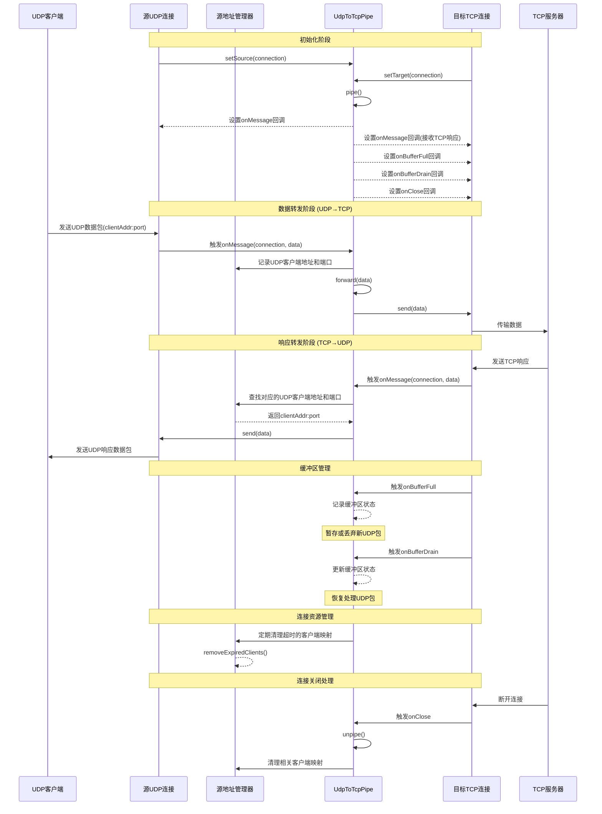

# UDP 到 TCP 连接转发流程

本文档详细说明 workerman-connection-pipe 中 UDP 到 TCP 连接的数据转发工作流程。此类转发主要应用于允许 UDP 客户端访问 TCP 服务的场景，如游戏服务器、实时通信系统等。

## 流程图

## 详细工作流程说明

### 1. 初始化流程

UDP 到 TCP 连接管道的初始化需要处理一系列的设置和配置：

1. **设置源连接和目标连接**
   - 通过 `setSource()` 方法设置源 UDP 连接，确保是 `UdpConnection` 类型
   - 通过 `setTarget()` 方法设置目标 TCP 连接，确保是 `TcpConnection` 类型
   - 如果连接类型不匹配，将抛出类型异常

2. **启动管道**
   - 调用 `pipe()` 方法激活管道，设置 `isActive = true`
   - 记录管道启动日志，包含唯一的管道ID和协议信息
   - 返回管道实例，支持链式调用

3. **设置回调函数**
   - 在源 UDP 连接上设置 `onMessage` 回调，用于接收和处理 UDP 客户端数据
   - 在目标 TCP 连接上设置 `onMessage` 回调，用于接收 TCP 服务器响应
   - 在目标 TCP 连接上设置 `onBufferFull` 回调，处理 TCP 发送缓冲区满的情况
   - 在目标 TCP 连接上设置 `onBufferDrain` 回调，处理 TCP 发送缓冲区排空的情况
   - 在目标 TCP 连接上设置 `onClose` 回调，处理 TCP 连接关闭的情况

4. **源地址管理**
   - 初始化源地址管理器，用于维护 UDP 客户端地址与 TCP 连接的映射关系
   - 这一步对于支持多客户端至关重要，确保响应能正确回传给对应的 UDP 客户端

### 2. 数据转发流程（UDP 到 TCP）

当 UDP 客户端发送数据包时，转发流程如下：

1. **接收 UDP 客户端数据**
   - 源 UDP 连接接收到客户端发送的数据包，同时获取客户端的地址和端口
   - 触发 `onMessage` 回调，将连接对象和数据传递给管道

2. **客户端地址记录**
   - 在源地址管理器中记录 UDP 客户端的地址和端口
   - 为客户端分配唯一标识，或使用地址:端口作为标识
   - 记录客户端的最后活动时间，用于后续的超时清理

3. **数据转发处理**
   - 管道的 `forward()` 方法检查活动状态，如不活动则中止转发
   - 记录详细的转发日志，包含数据长度、源客户端信息和目标TCP连接信息
   - 调用目标 TCP 连接的 `send()` 方法将数据发送到 TCP 服务器

4. **发送结果处理**
   - 检查 TCP 发送结果，如发送失败则记录错误日志
   - 根据配置，触发 `DataForwardedEvent` 或 `ForwardFailedEvent` 事件
   - 可选择在失败时通知源 UDP 客户端，如通过错误包或重试机制

### 3. 响应转发流程（TCP 到 UDP）

当 TCP 服务器返回响应数据时，处理流程如下：

1. **接收 TCP 服务器响应**
   - 目标 TCP 连接接收到服务器返回的数据
   - 触发 TCP 连接的 `onMessage` 回调，将连接对象和数据传递给管道

2. **查找对应的 UDP 客户端**
   - 根据当前的 TCP 连接或会话状态，在源地址管理器中查找对应的 UDP 客户端
   - 获取 UDP 客户端的地址和端口信息
   - 如果找不到对应客户端，则记录错误日志并可能丢弃响应

3. **发送响应到 UDP 客户端**
   - 使用源 UDP 连接的 `send()` 方法，将响应数据发送到对应的 UDP 客户端
   - 连接内部会处理客户端地址和端口信息，确保响应准确送达
   - 更新客户端的最后活动时间，延长其在映射中的生命周期

### 4. 客户端识别与会话管理

UDP 到 TCP 转发的一个核心挑战是客户端识别和会话管理：

1. **客户端标识策略**
   - 基本方法：使用客户端的 IP 地址和端口作为唯一标识
   - 高级方法：实现应用层会话ID，处理 NAT 环境下的地址变化

2. **会话状态维护**
   - 对每个 UDP 客户端维护独立的会话状态
   - 包含最后活动时间、累计数据量、重传计数等信息
   - 可用于实现更复杂的业务逻辑，如负载均衡或会话保持

3. **超时清理机制**
   - 定期检查并清理长时间不活动的客户端映射
   - 默认超时时间可配置，通常根据具体应用场景调整
   - 在清理前可选择发送断开通知给客户端

### 5. 缓冲区管理

处理 TCP 连接的缓冲区状态对于 UDP 到 TCP 转发至关重要：

1. **TCP 缓冲区满的处理**
   - 当 TCP 发送缓冲区满时，触发 `onBufferFull` 回调
   - 由于 UDP 没有流控机制，管道需要决定是暂存还是丢弃新到达的 UDP 数据包
   - 对于重要数据，可实现缓存队列；对于实时数据，可能直接丢弃

2. **TCP 缓冲区排空后的处理**
   - 当 TCP 发送缓冲区排空时，触发 `onBufferDrain` 回调
   - 管道更新缓冲区状态，恢复正常的数据处理流程
   - 如果实现了数据包缓存，可以开始处理缓存队列中的数据

3. **优先级和服务质量**
   - 可选实现数据包优先级机制，确保重要数据优先处理
   - 在高负载情况下，可基于客户端优先级或数据类型进行选择性丢包

### 6. 连接关闭处理

管理连接关闭是确保资源正确释放的关键：

1. **TCP 连接关闭**
   - 当 TCP 服务器断开连接时，触发目标 TCP 连接的 `onClose` 回调
   - 管道调用 `unpipe()` 方法停止数据转发
   - 根据应用需求，可能需要通知相关的 UDP 客户端连接已断开

2. **资源清理**
   - 释放与关闭的 TCP 连接相关的资源
   - 清理源地址管理器中的客户端映射
   - 记录相关日志，便于后续问题排查

3. **重连机制**
   - 对于需要保持长期连接的应用，可实现 TCP 连接断开后的自动重连
   - 在重连成功后，恢复转发并更新相关的客户端映射

### 7. 应用场景与优化建议

UDP 到 TCP 转发适用于多种场景，并有相应的优化建议：

1. **游戏服务器**
   - 场景：将游戏客户端的 UDP 数据包转发到 TCP 游戏服务器
   - 优化：实现数据包的优先级处理，确保关键游戏事件及时传递

2. **流媒体转发**
   - 场景：将 UDP 流媒体数据转发到 TCP 服务
   - 优化：适当增大 TCP 缓冲区，处理大量持续数据

3. **物联网应用**
   - 场景：将 UDP 设备数据转发到 TCP 后端服务
   - 优化：实现高效的设备识别和会话管理，处理大量轻量级连接

4. **性能调优**
   - 对于高并发场景，考虑实现 TCP 连接池，减少连接建立开销
   - 使用异步 I/O 或协程模型，提高并发处理能力
   - 实现高效的内存管理，避免频繁的内存分配和释放
