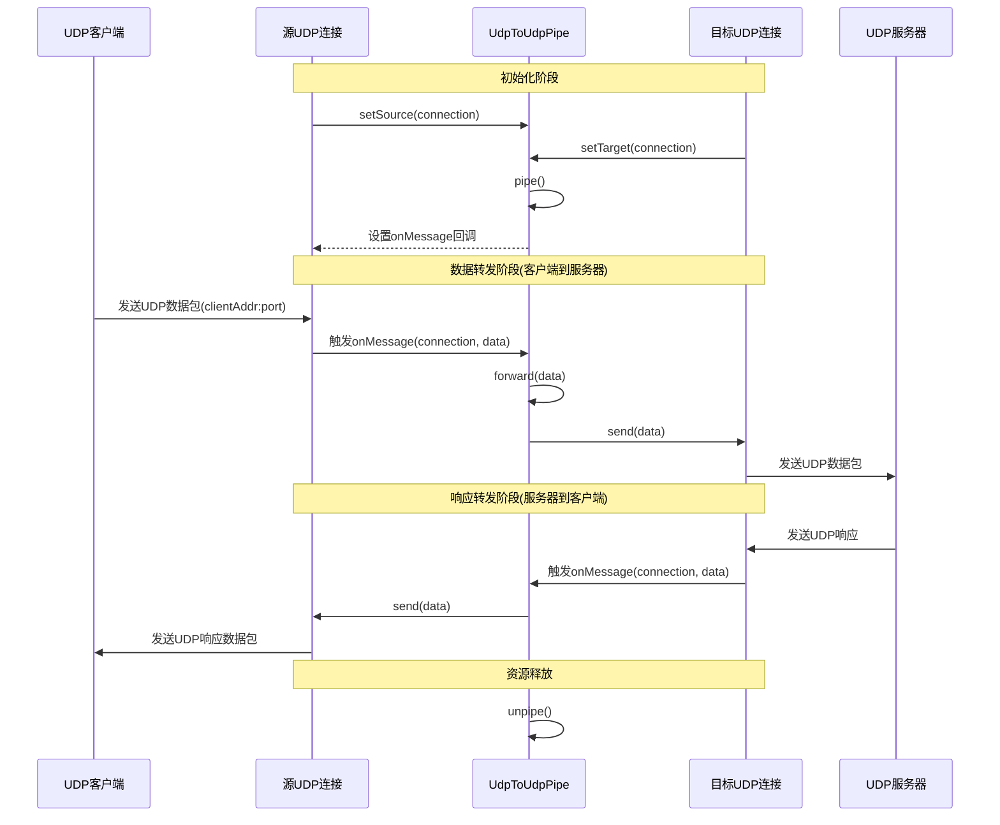

# UDP 到 UDP 连接转发流程

本文档详细说明 workerman-connection-pipe 中 UDP 到 UDP 连接的数据转发工作流程，包括 UDP 穿透和会话维护的实现。此类转发主要用于 UDP 穿透、游戏加速、流媒体中继等场景。

## 流程图

## 详细工作流程说明

### 1. 初始化流程

UDP 到 UDP 连接管道的初始化涉及到连接设置和回调配置：

1. **设置源连接和目标连接**
   - 通过 `setSource()` 方法设置源 UDP 连接，接收客户端数据
   - 通过 `setTarget()` 方法设置目标 UDP 连接，转发到服务器
   - 确保两个连接都是 `UdpConnection` 类型，否则抛出类型异常

2. **启动管道**
   - 调用 `pipe()` 方法激活管道，设置 `isActive = true`
   - 设置回调函数，在源 UDP 连接上设置 `onMessage` 回调，处理客户端数据
   - 初始化日志记录和事件分发

### 2. 数据转发流程（客户端到服务器）

当 UDP 客户端发送数据到源连接时，转发流程如下：

1. **接收 UDP 客户端数据**
   - 源 UDP 连接接收到客户端发送的数据包，获取客户端地址和端口
   - 触发 `onMessage` 回调，将连接对象和数据传递给管道

2. **数据转发处理**
   - 管道的 `forward()` 方法处理实际数据转发
   - 验证管道状态，确保处于活动状态
   - 记录转发日志，包括数据长度、源客户端信息和目标服务器信息

3. **发送到目标服务器**
   - 调用目标 UDP 连接的 `send()` 方法，将数据发送到目标服务器
   - 触发事件分发器的 `DataForwardedEvent` 事件（如已配置）

### 3. 响应转发流程（服务器到客户端）

服务器响应数据的处理流程如下：

1. **接收服务器响应**
   - 目标 UDP 连接接收到服务器返回的数据包，获取服务器地址和端口
   - 触发 `onMessage` 回调，将连接对象和数据传递给管道

2. **发送响应到客户端**
   - 使用源 UDP 连接的 `send()` 方法，将响应数据发送回客户端
   - 连接内部会处理客户端地址和端口信息，确保响应准确送达
   - 触发事件分发器的 `DataForwardedEvent` 事件

### 4. UDP 会话管理

由于 UDP 是无连接的协议，管理客户端会话非常重要：

1. **会话跟踪**
   - 使用客户端地址和端口作为唯一标识符
   - 为每个客户端创建和维护会话信息
   - 记录最后活动时间，用于超时清理

2. **超时处理**
   - 定期检查会话的最后活动时间
   - 清理长时间不活跃的会话，释放资源
   - 配置可调的超时时间，适应不同应用场景

### 5. 错误处理和日志记录

完善的错误处理和日志记录对于 UDP 转发服务至关重要：

1. **错误捕获与处理**
   - 捕获数据发送过程中的异常
   - 记录详细的错误信息，包括客户端地址、数据大小等
   - 触发 `ForwardFailedEvent` 事件，通知监听器

2. **日志记录**
   - 记录关键操作的日志，如连接初始化、数据转发、错误情况
   - 日志中包含必要的上下文信息，便于故障排查
   - 支持配置不同的日志级别，适应开发和生产环境

### 6. 性能优化建议

高效的 UDP 转发需要考虑以下性能优化点：

1. **资源管理**
   - 控制会话数量，避免无限增长
   - 及时释放不活跃会话的资源
   - 使用高效的数据结构管理会话信息

2. **缓冲区管理**
   - 针对不同数据包大小优化缓冲区
   - 避免频繁的内存分配和释放
   - 处理超大数据包的分片与重组

3. **多进程处理**
   - 在多核系统上使用多进程模式
   - 合理分配进程数，避免上下文切换开销
   - 考虑使用共享内存或其他机制共享会话信息

### 7. 应用场景示例

UDP 到 UDP 转发适用于多种场景：

1. **游戏加速器**
   - 减少游戏数据包的延迟和丢包
   - 优化游戏数据的路由路径
   - 保持游戏会话的稳定性

2. **音视频传输**
   - 转发实时音视频流
   - 处理媒体数据的丢包和重传
   - 优化不同网络环境下的传输质量

3. **IoT 设备通信**
   - 转发来自大量 IoT 设备的小数据包
   - 管理设备的长期连接状态
   - 处理设备断连和重连情况
